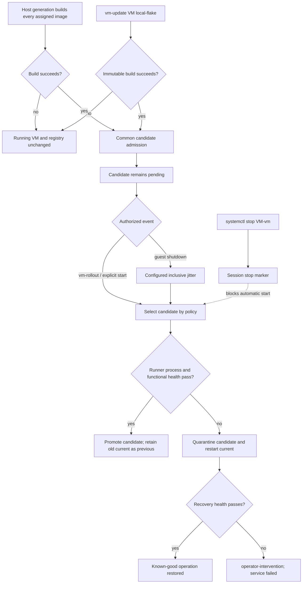

# nixos-shell-vm-manager

Transactional, offline-ready lifecycle management for
[`nixos-shell`](https://github.com/Mic92/nixos-shell) VMs.

The consumer flake builds every assigned VM image as part of its NixOS host
generation. Host activation only admits those immutable outputs as candidates;
it never starts or restarts a VM. Runtime startup consumes a local image and its
closure and never evaluates or builds a flake.

## Guarantees

- A running VM remains active while a baseline or local candidate is built.
- Failed builds do not alter `current`, `candidate`, or the running process.
- Baseline images use the consumer host's own pinned dependency graph.
- A local update snapshots `flake.nix`, `flake.lock`, and source into the Nix
  store without refreshing the lock.
- Baseline and local candidates use the same process plus functional-health
  gate, promotion, and verified rollback.
- `systemctl stop <vm>-vm` revokes prior start authority for the host session;
  candidate admission does not clear it.
- Root QCOW files default to `/var/cache`, not a persistence mount. Persistent
  guest storage is independently configurable and never rewound by rollback.
- Per-VM lifecycle locks and a bounded host build-token pool coordinate work.

The controlled requirements and design chain are under [`GAMP`](./GAMP).

## Flake integration

Pin this repository as a normal consumer input:

```nix
{
  inputs.nixos-shell-vm-manager = {
    url = "github:esp0xdeadbeef/nixos-shell-vm-manager";
    inputs.nixpkgs.follows = "nixpkgs";
  };
}
```

Import the module and pass direct image derivations. The manager does not need a
repository URL or knowledge of the consumer's layout:

```nix
{ inputs, pkgs, self, ... }:
{
  imports = [
    inputs.nixos-shell-vm-manager.nixosModules.default
  ];

  services.nixosShellVmManager = {
    enable = true;
    maxConcurrentBuilds = 1;

    instances.my-vm = {
      image =
        self.nixosConfigurations.my-vm.config.system.build.nixos-shell;

      healthCheck = {
        command = "${pkgs.iputils}/bin/ping -c 1 -W 2 my-vm";
        timeoutSeconds = 10;
        retries = 12;
        intervalSeconds = 5;
      };

      activation = {
        startOnBoot = false;
        restartOnGuestShutdown = true;
        rolloutCandidateOnGuestShutdown = true;
        useCandidateOnExplicitStart = true;
        guestShutdownJitter = {
          minSeconds = 1;
          maxSeconds = 4;
        };
      };
    };
  };
}
```

Every enabled `image` is added to `system.extraDependencies`. Consequently,
building the host generation builds all assigned images; a missing or failed
image prevents that generation from completing. Activation registers the
result as a `host-generation` candidate without changing the running VM.

Each `healthCheck.command` is mandatory and VM-specific. Process survival alone
cannot promote a candidate. For an HTTP service, for example:

```nix
healthCheck.command = ''
  ${pkgs.curl}/bin/curl --fail http://my-vm:8080/health
'';
```

## Lifecycle

The registry retains four immutable slots:

| Slot | Meaning |
| --- | --- |
| `current` | Proven known-good image used for normal starts and recovery. |
| `candidate` | Successfully built and admitted, but not yet proven. |
| `previous` | Known-good image retained when a new candidate is promoted. |
| `failed` | Quarantined candidate that automatic paths do not retry. |



On a guest-initiated shutdown, the foreground supervisor remains alive. It can
wait the configured jitter and roll out a pending candidate, or restart current
according to that VM's policy. Stopping the systemd service is a separate event:
the stop marker is written before the runner is terminated and guest recovery
is not entered.

## Operator commands

Build and transactionally roll out from an explicit local working tree:

```console
sudo vm-update my-vm /path/to/local/flake
```

The directory must contain both `flake.nix` and `flake.lock`. The source is
archived first, with lock updates and lock writes disabled. A stop issued after
the action starts revokes its final rollout while leaving a successful candidate
pending.

Roll out an already admitted candidate or inspect state:

```console
sudo vm-rollout my-vm
sudo vm-status my-vm | jq
```

Direct service operations remain valid:

```console
sudo systemctl start my-vm-vm.service
sudo systemctl stop my-vm-vm.service
```

An explicit start uses the pending candidate only when
`useCandidateOnExplicitStart` is enabled. Automatic admission never starts a
stopped service.

## Storage

Defaults are deliberately independent:

| Class | Default |
| --- | --- |
| Registry metadata | `/var/lib/nixos-shell-vm-manager/<vm>` |
| Replaceable root/runtime | `/var/cache/nixos-shell-vm-manager/<vm>` |
| Optional persistent disk | `/var/lib/nixos-shell-vm-manager/persistent/<vm>` |
| Session authority/control | `/run/nixos-shell-vm-manager/<vm>` |
| Immutable image GC roots | `/nix/var/nix/gcroots/nixos-shell-vm-manager/<vm>` |

All base directories are module options. `storage.ephemeralRoot` defaults to
`true`. `storage.persistentDisk.enable` defaults to `false`, allowing consumers
that already provide persistent guest storage through nixos-shell mounts to keep
that design. The manager never requires `/persist`.

## Verification

```console
nix fmt
nix flake check
```

Checks include NixOS module evaluation and seeded-invalid policy assertions,
ShellCheck, isolated state-machine tests with fake immutable runners, and a real
NixOS/systemd integration VM. HAT and SAT evidence are separate GAMP layers;
construction checks do not imply live-host or stakeholder acceptance.
