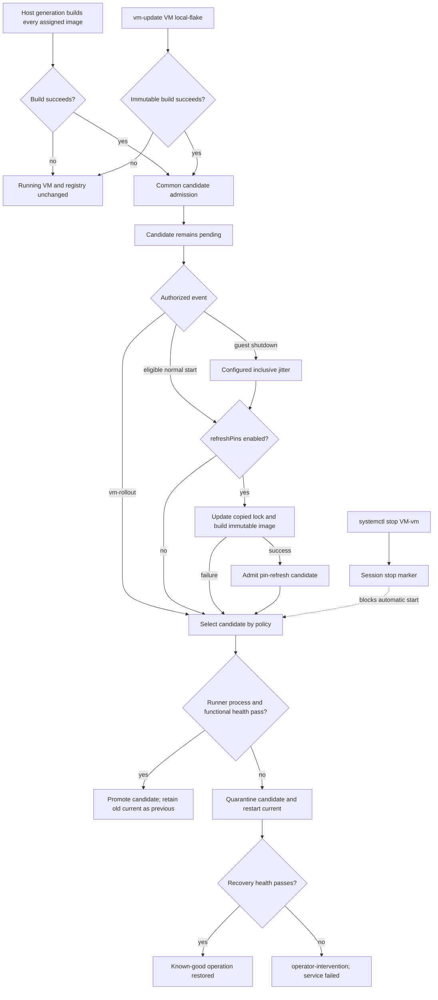

# nixos-shell-vm-manager

Transactional, offline-ready lifecycle management for
[`nixos-shell`](https://github.com/Mic92/nixos-shell) VMs.

The consumer flake builds every assigned VM image as part of its NixOS host
generation. Host activation only admits those immutable outputs as candidates;
it never starts or restarts a VM. Runtime startup consumes a local image and its
closure by default. A per-VM opt-in can best-effort refresh an approved flake's
dependency pins and construct a candidate before eligible starts.

## Guarantees

- A running VM remains active while a baseline or local candidate is built.
- Failed builds do not alter `current`, `candidate`, or the running process.
- Baseline images use the consumer host's own pinned dependency graph.
- Pin refresh is disabled by default; enabled refresh updates only an isolated
  copy and never rewrites the consumer's host-generation lock.
- Pin-refresh VMs backed by the host flake share the last successfully
  published runtime lock; custom repositories use a distinct lock scope.
- Failed pin refresh leaves all admitted slots unchanged and starts the local
  host-pinned image when one is available.
- A local update snapshots `flake.nix`, `flake.lock`, and source into the Nix
  store without refreshing the lock.
- Baseline and local candidates use the same process plus functional-health
  gate, promotion, and verified rollback.
- `systemctl stop <vm>-vm` revokes prior start authority for the host session;
  candidate admission does not clear it.
- Root QCOW files default to `/var/cache`, not a persistence mount. Persistent
  guest storage is independently configurable and never rewound by rollback.
- Per-VM lifecycle locks and a bounded host build-token pool coordinate work.

The controlled requirements and design chain are under [`GAMP`](./GAMP).

## Flake integration

Pin this repository as a normal consumer input:

```nix
{
  inputs.nixos-shell-vm-manager = {
    url = "github:esp0xdeadbeef/nixos-shell-vm-manager";
    inputs.nixpkgs.follows = "nixpkgs";
  };
}
```

Import the module and pass direct image derivations. Normal host-pinned startup
does not need a repository URL or knowledge of the consumer's layout. Optional
online pin refresh accepts one opaque, revision-pinned flake reference:

```nix
{ inputs, lib, pkgs, self, ... }:
let
  qgaHealth =
    inputs.nixos-shell-vm-manager.packages.${pkgs.stdenv.hostPlatform.system}.qga-systemd-health;
in
{
  imports = [
    inputs.nixos-shell-vm-manager.nixosModules.default
  ];

  services.nixosShellVmManager = {
    enable = true;
    maxConcurrentBuilds = 1;

    instances.my-vm = {
      image =
        self.nixosConfigurations.my-vm.config.system.build.nixos-shell;

      # Optional compatibility override when the image uses another runner name.
      # runner.relativePath = "bin/run-my-compatible-vm";

      healthCheck = {
        # This checks the exact guest through QGA. With no guest command,
        # qga-systemd-health succeeds when systemd has no failed units.
        command = lib.escapeShellArgs [
          (lib.getExe qgaHealth)
          "/run/nixos-shell-vm-manager/my-vm/qga.sock"
        ];
        timeoutSeconds = 10;
        retries = 60;
        intervalSeconds = 2;
      };

      runner.qemuArguments = [
        "-chardev"
        "socket,id=qga0,path=/run/nixos-shell-vm-manager/my-vm/qga.sock,server=on,wait=off"
        "-device"
        "virtserialport,chardev=qga0,name=org.qemu.guest_agent.0"
      ];

      activation = {
        startOnBoot = false;
        restartOnGuestShutdown = true;
        rolloutCandidateOnGuestShutdown = true;
        useCandidateOnExplicitStart = true;
        refreshPins = false;
        guestShutdownJitter = {
          minSeconds = 1;
          maxSeconds = 4;
        };
      };

      # Required only when activation.refreshPins is enabled.
      pinRefresh = {
        flakeRef = "github:example/consumer/${self.rev}";
        flakeAttribute =
          "nixosConfigurations.my-vm.config.system.build.nixos-shell";
        # The default "host" scope is shared by host-flake VMs. Set a stable,
        # distinct name when this VM refreshes a custom repository.
        lockScope = "host";
      };

      # Enabled by default. These are the default values:
      console = {
        enable = true;
        socketPath = "/run/nixos-shell/my-vm.tmux";
        sessionName = "vm";
      };
    };

    carrierControls.uplink-vms = {
      interface = "eno1";
      requiredInterfaces = [
        "vmbr1"
        "vmbr4"
      ];
      instances = [ "my-vm" ];
    };
  };
}
```

Every enabled `image` is added to `system.extraDependencies`. Consequently,
building the host generation builds all assigned images; a missing or failed
image prevents that generation from completing. Activation registers the
result as a `host-generation` candidate without changing the running VM.

### Optional pin refresh

Set `activation.refreshPins = true` to re-resolve the approved VM flake's
declared inputs before a boot start, ordinary explicit service start, or
guest-shutdown restart. The manager first archives `pinRefresh.flakeRef`, copies
that immutable result to a private writable workspace, overlays the last
successfully published runtime lock from `pinRefresh.lockScope`, updates that
copy's `flake.lock`, archives it immutably, and builds
`pinRefresh.flakeAttribute`. Prefer a revision-pinned remote reference so the
approved source is reproducible without making the complete consumer repository
a host-generation dependency.

Every eligible start performs `nix flake update --refresh` in that isolated
copy, so upstream pin changes are picked up without a background timer. The
default `host` scope is serialized and shared by every host-flake VM on the
box, so each update starts from the latest successful host lock instead of the
older lock embedded separately in each host-generation source. A custom flake
repository must use its own stable scope name. The refreshed lock is published
atomically only after its VM image is successfully admitted. The resulting
image uses the normal health-gated promotion and rollback transaction.

Refresh is best effort. Resolution, archive, or build failure leaves all image
slots unchanged and continues with the locally available host-pinned image.
`vm-update`, `vm-rollout` of an admitted candidate, rollback, and recovery never
refresh pins. Normal startup remains fully offline when the flag is absent or
false.

Each `healthCheck.command` is mandatory and VM-specific. Process survival alone
cannot promote a candidate. For an HTTP service, for example:

```nix
healthCheck.command = ''
  ${pkgs.curl}/bin/curl --fail http://my-vm:8080/health
'';
```

For consumers that use a QEMU Guest Agent healthcheck, `qga.sock` is reserved
inside the per-VM control directory. The manager removes that transient socket
before launch and after runner exit so a stale endpoint cannot block recovery.
The flake exports `packages.<system>.qga-systemd-health`, which performs a
guest-agent ping and then executes a command inside that exact guest. With only
the socket argument, its network-independent default succeeds when
`systemctl list-units --state=failed` is empty. A caller may append a custom
guest command and arguments when a VM needs a stricter functional check. The
helper uses one synchronized QGA connection, so responses buffered before
guest-agent readiness cannot be mistaken for the current request. Promotion
follows the guest command's exit status; captured guest stdout and stderr are
logged when the command fails.

The module's `carrierControls` option starts selected instances on carrier-up
and records the distinct automatic `carrier-down` stop reason before stopping
them on carrier-down. Carrier-up may reverse only that automatic reason; it
never clears an operator's `explicit-stop`. `requiredInterfaces` adds systemd
device ordering for bridges or other host interfaces that must exist before the
watcher starts. Carrier-controlled instances may not also set
`activation.startOnBoot`. The flake additionally exports the underlying
`packages.<system>.carrier-watcher` for consumers that need a custom adapter;
the generated module path routes its actions through the manager's authority
protocol.

`runner.relativePath` defaults to `bin/run-<instance-name>-vm`. It may be set to
another safe relative path when a flake configuration intentionally retains a
different guest or runner name. Absolute paths and `..` path segments are
rejected during module evaluation.

## Lifecycle

The registry retains four immutable slots:

| Slot | Meaning |
| --- | --- |
| `current` | Proven known-good image used for normal starts and recovery. |
| `candidate` | Successfully built and admitted, but not yet proven. |
| `previous` | Known-good image retained when a new candidate is promoted. |
| `failed` | Quarantined candidate that automatic paths do not retry. |



On a guest-initiated shutdown, the foreground supervisor remains alive. It can
wait the configured jitter and roll out a pending candidate, or restart current
according to that VM's policy. Stopping the systemd service is a separate event:
the stop marker is written before the runner is terminated and guest recovery
is not entered. Systemd also recovers an unexpectedly terminated supervisor.
It does not override a disabled `restartOnGuestShutdown` policy, carrier-down,
an explicit service stop, or a terminal candidate-and-recovery failure.

## Offline console

Every instance exposes its runner console through a stable host-local tmux
socket by default. It does not use guest networking, so the console remains
attachable when the guest has no network access:

```console
sudo vm-attach my-vm
```

The equivalent low-level tmux command is:

```console
tmux -S /run/nixos-shell/my-vm.tmux attach -t vm
```

`tmux list-sessions` without `-S` inspects tmux's unrelated default server. To
inspect a VM console directly, always provide its socket:

```console
tmux -S /run/nixos-shell/my-vm.tmux list-sessions
```

The same socket and session name are recreated for explicit starts, candidate
rollouts, guest-shutdown restarts, and rollback. They remain stable even when
the immutable image path changes. `console.socketPath` and
`console.sessionName` are configurable per VM, and `console.enable = false`
opts out. Stopping the VM service removes its live console endpoint.

After `nixos-rebuild switch`, an already running VM intentionally keeps its
old manager process because VM services set `restartIfChanged = false`. This
protects availability. An authorized guest shutdown hands recovery back to
systemd, so the replacement supervisor uses the currently loaded manager and
generated instance configuration before it selects and checks the next image.
A VM started by a manager generation without console support still cannot gain
a tmux session in place; `vm-attach` reports this as an unavailable session.
The new console is created on the next guest-shutdown recovery or deliberate
service stop/start; do not restart solely to obtain it when downtime is
unacceptable.

## Operator commands

First list the configured instance names:

```console
vm-list
```

Use those exact names with the other `vm-*` commands. Names such as `my-vm` in
this README are examples, not literal commands for every host. Only the
systemd unit adds the `-vm.service` suffix: instance `s-test-l-esp` maps to
service `s-test-l-esp-vm.service`.

| Task | Command |
| --- | --- |
| List managed instance names | `vm-list` |
| Inspect registry, authority, and runner PID | `sudo vm-status VM` |
| Attach the offline console | `sudo vm-attach VM` |
| Build and roll out a local working tree | `sudo vm-update VM /path/to/flake` |
| Roll out an admitted candidate | `sudo vm-rollout VM` |
| Explicitly start or stop | `sudo systemctl start\|stop VM-vm.service` |

`nixos-shell-vm-manager` itself is the internal systemd engine. Subcommands
such as its internal `status` and `update` take generated configuration paths,
not VM names. Run `nixos-shell-vm-manager --help` to see that internal boundary;
operators normally do not call it directly.

`vm-status VM` returns JSON. `current` is the proven image in use;
`candidate` is merely pending until an authorized rollout succeeds. `phase`
describes the lifecycle state, `authority.explicitlyStopped` identifies an
operator stop, `authority.stopReason` distinguishes it from an automatic
`carrier-down`, and `runnerPid` identifies the observed runner. A non-null
candidate does not mean the running VM has already changed.

Build and transactionally roll out from an explicit local working tree:

```console
sudo vm-update my-vm /path/to/local/flake
```

The directory must contain both `flake.nix` and `flake.lock`. The source is
archived first, with lock updates and lock writes disabled. A stop issued after
the action starts revokes its final rollout while leaving a successful candidate
pending. `vm-update` deliberately preserves the selected local lock even when
the instance enables automatic pin refresh.

Roll out an already admitted candidate or inspect state:

```console
sudo vm-rollout my-vm
sudo vm-status my-vm | jq
```

Direct service operations remain valid:

```console
sudo systemctl start my-vm-vm.service
sudo systemctl stop my-vm-vm.service
```

An explicit start uses the pending candidate only when
`useCandidateOnExplicitStart` is enabled. Automatic admission never starts a
stopped service.

## Storage

Defaults are deliberately independent:

| Class | Default |
| --- | --- |
| Registry metadata | `/var/lib/nixos-shell-vm-manager/<vm>` |
| Replaceable root/runtime | `/var/cache/nixos-shell-vm-manager/<vm>` |
| Optional persistent disk | `/var/lib/nixos-shell-vm-manager/persistent/<vm>` |
| Session authority/control | `/run/nixos-shell-vm-manager/<vm>` |
| Immutable image GC roots | `/nix/var/nix/gcroots/nixos-shell-vm-manager/<vm>` |

All base directories are module options. `storage.ephemeralRoot` defaults to
`true`. `storage.persistentDisk.enable` defaults to `false`, allowing consumers
that already provide persistent guest storage through nixos-shell mounts to keep
that design. The manager never requires `/persist`.

## Verification

```console
nix fmt
nix flake check
```

Checks include NixOS module evaluation and seeded-invalid policy assertions,
ShellCheck, isolated state-machine tests with fake immutable runners, and a real
NixOS/systemd integration VM. Pin-refresh checks include updated-lock capture,
source immutability, disabled and excluded paths, failed-refresh fallback, and
real systemd admission. HAT and SAT evidence are separate GAMP layers;
construction checks do not imply live-host or stakeholder acceptance.
