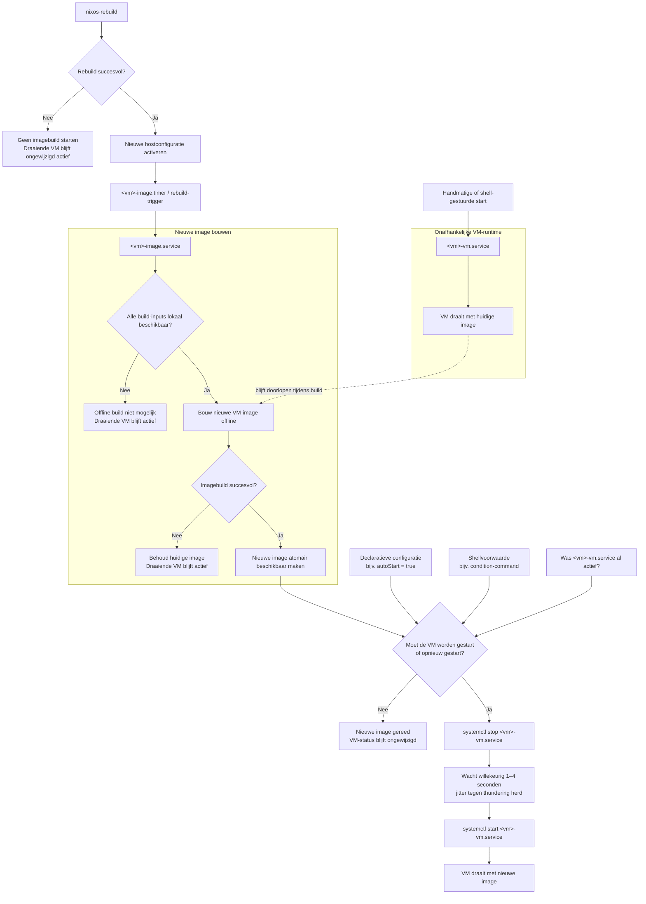

```mermaid
flowchart TD
    REBUILD["nixos-rebuild"] --> REBUILD_OK{"Rebuild succesvol?"}

    REBUILD_OK -- Nee --> NO_CHANGE["Geen imagebuild starten<br/>Draaiende VM blijft ongewijzigd actief"]
    REBUILD_OK -- Ja --> ACTIVATE["Nieuwe hostconfiguratie activeren"]

    ACTIVATE --> IMAGE_TRIGGER["&lt;vm&gt;-image.timer / rebuild-trigger"]
    IMAGE_TRIGGER --> IMAGE_SERVICE["&lt;vm&gt;-image.service"]

    subgraph RUNTIME["Onafhankelijke VM-runtime"]
        VM_SERVICE["&lt;vm&gt;-vm.service"]
        OLD_VM["VM draait met huidige image"]
        VM_SERVICE --> OLD_VM
    end

    subgraph IMAGE_BUILD["Nieuwe image bouwen"]
        IMAGE_SERVICE --> OFFLINE_READY{"Alle build-inputs lokaal beschikbaar?"}
        OFFLINE_READY -- Nee --> BUILD_BLOCKED["Offline build niet mogelijk<br/>Draaiende VM blijft actief"]
        OFFLINE_READY -- Ja --> BUILD_IMAGE["Bouw nieuwe VM-image offline"]

        OLD_VM -. "blijft doorlopen tijdens build" .-> BUILD_IMAGE

        BUILD_IMAGE --> BUILD_OK{"Imagebuild succesvol?"}
        BUILD_OK -- Nee --> KEEP_OLD["Behoud huidige image<br/>Draaiende VM blijft actief"]
        BUILD_OK -- Ja --> NEW_IMAGE["Nieuwe image atomair beschikbaar maken"]
    end

    NEW_IMAGE --> RESTART_POLICY{"Moet de VM worden gestart<br/>of opnieuw gestart?"}

    CONFIG["Declaratieve configuratie<br/>bijv. autoStart = true"] --> RESTART_POLICY
    SHELL["Shellvoorwaarde<br/>bijv. condition-command"] --> RESTART_POLICY
    WAS_RUNNING["Was &lt;vm&gt;-vm.service al actief?"] --> RESTART_POLICY

    RESTART_POLICY -- Nee --> IMAGE_ONLY["Nieuwe image gereed<br/>VM-status blijft ongewijzigd"]

    RESTART_POLICY -- Ja --> STOP_VM["systemctl stop &lt;vm&gt;-vm.service"]
    STOP_VM --> JITTER["Wacht willekeurig 1–4 seconden<br/>jitter tegen thundering herd"]
    JITTER --> START_VM["systemctl start &lt;vm&gt;-vm.service"]
    START_VM --> NEW_VM["VM draait met nieuwe image"]

    MANUAL["Handmatige of shell-gestuurde start"] --> VM_SERVICE
```
